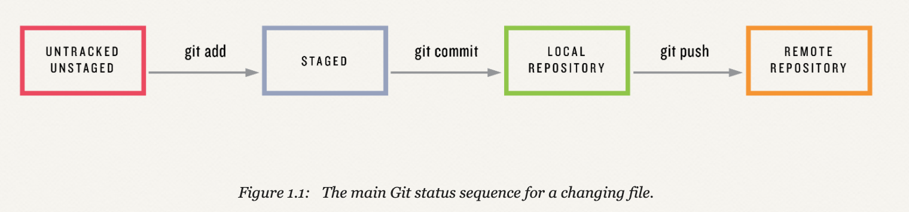
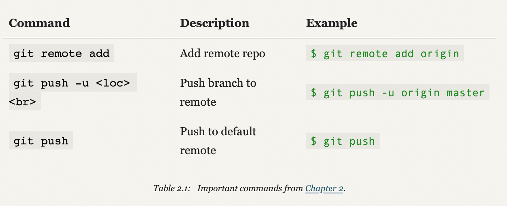
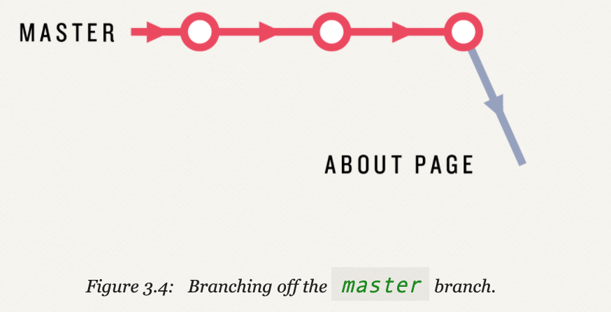
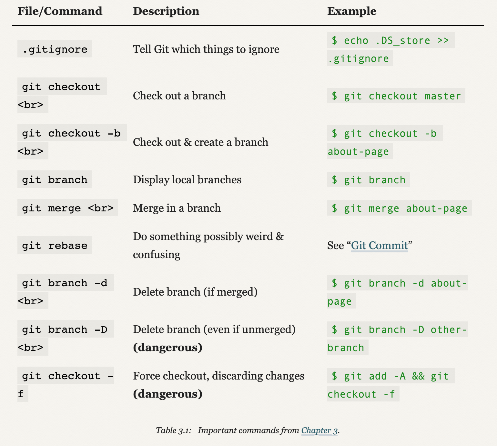
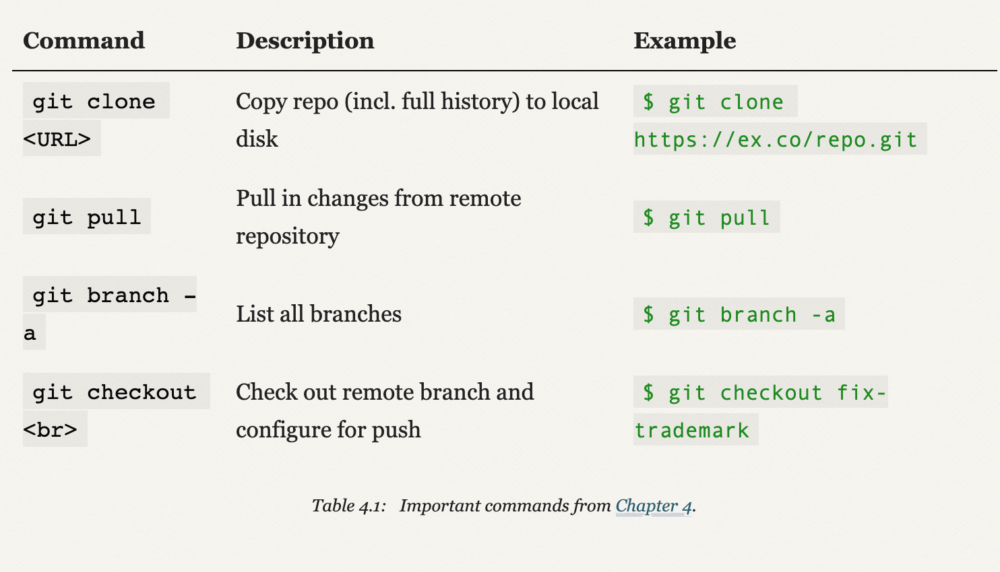

1. Create repo
```bash
$ mkdir -p repos/website
$ cd repos/website/
```

2. Initializing a Git repository
```bash
$ git init
```

3. First commit 
```bash
$ touch index.html
$ git status
$ git add -A
$ git commit -m "Initialize repository"
$ git log
```

State of changes:

* source: https://www.learnenough.com/course/learn_enough_git/getting_started/our_first_commit


4. Using diff
```bash
$ echo "hello, world" > index.html
$ diff foo bar
$ git diff
$ git commit -a -m "Add content to index.html"
$ git diff
$ git log
$ git commit --amend  # if we want to fix typo in commit
```

5. Adding HTML tag
```bash
$ atom index.html
$ git status
$ git diff
$ git commit -am "Add an h1 tag"
```

6. Adding README.md
```bash
$ atom README.md
$ git add -A
$ git commit -m "Add README file"
$ git push
```

Important commands:

* source: https://www.learnenough.com/course/learn_enough_git/sharing/summary_sharing

7. Commit, push, repeat
```bash
$ mkdir images
$ curl -o images/breaching_whale.jpg -OL https://cdn.learnenough.com/breaching_whale.jpg
```

Add to ~/repos/website/index.html
```html
<!DOCTYPE html>
<html>
  <head>
    <title>A whale of a greeting</title>
  </head>
  <body>
    <h1>hello, world</h1>
    <p>Call me Ishmael.</p>
    
  </body>
</html>
```

```bash
$ git diff index.html
$ git status
$ git add -A
$ git commit -m "Add an image"
$ git push
```

8. Ignoring files
```bash
$ touch .DS_Store
$ git status
$ touch .gitignore
$ echo ".DS_Store" > .gitignore
$ cat .gitignore
$ git add -A
$ git commit -m "Add an image"
$ git push
```

9. Working on branch
```bash
$ git checkout -b about-page
$ git branch
```

Branch:

* source: https://www.learnenough.com/course/learn_enough_git/intermediate_workflow/branching_and_merging

```branch
$ cp index.html about.html
$ atom .
```

Add to ~/repos/website/about.html
```html
<!DOCTYPE html>
<html>
  <head>
    <title>About Us</title>
  </head>
  <body>
    <h1>About</h1>
    <p>
      This site is a sample project for the <strong>awesome</strong> Git
      tutorial <em>Learn Enough™ Git to Be Dangerous</em>.
    </p>
  </body>
</html>
```

```bash
$ git add -A && git commit -m "Add About page"
$ git diff master
$ git checkout master
$ git merge about-page
$ git push
```

10. Recovering from errors
```bash
$ echo >> about.html    # Appends a newline to about.html
$ echo > about.html
$ cat about.html
$ git status
$ git checkout -f       # Checkout with force
$ git status
$ git checkout -b test-branch
$ git commit -am "Oops"
$ git checkout master
$ git branch -D test-branch
$ git log
$ git checkout <sha_of_commit_we_want_to_go_back_to>
$ git checkout master
```

Important commands:

* source: https://www.learnenough.com/course/learn_enough_git/intermediate_workflow/summary_intermediate_workflow

11. Colaboration

```bash
$ git push        # To push to remote repo
$ git clone       # To clone remote repo
$ git pull        # To get latest changes
```

12. Pushing branches
```bash
$ git checkout -b fix-trademark
$ git commit -am "Add placeholders for the TM fix"
$ git push -u origin fix-trademark

$ git pull
$ git branch -a 
$ git checkout fix-trademark
$ git diff master
$ git commit -am "Fix trademark character display"
$ git push

$ git pull
$ git merge fix-trademark
$ git push
```

Important commands:

* source: https://www.learnenough.com/course/learn_enough_git/collaborating/summary_collaborating

13. A checkout alias
```bash
$ git config --global alias.co checkout
$ git checkout master     # same as below
$ git co master
```